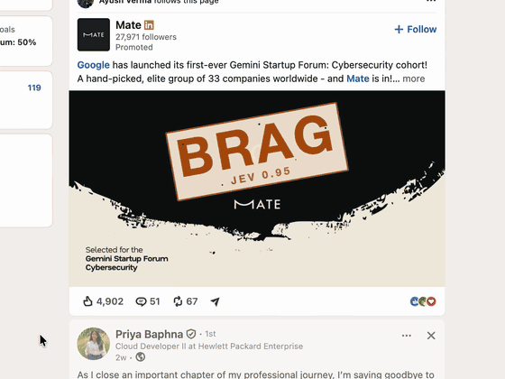

# Slop Filter for LinkedIn

Judges every LinkedIn post as it scrolls into view and slams a rubber stamp on
it — **BAIT**, **CORP**, or **BRAG** — with the confidence score printed on the
stamp. The post stays readable underneath.

Decisions come from [Jev](https://typesafe.ai), TypeSafe's System One model. It
returns a typed probability instead of text, so the extension branches on a
number rather than parsing prose.

<!-- Drop a demo.gif in docs/ and it renders here: -->
<!--  -->

## Run it

You need Node 20+, Chrome, and a TypeSafe API key from
[typesafe.ai](https://typesafe.ai).

```bash
git clone https://github.com/Arpit-Khandelwal/jev-linkedin-slop-filter
cd jev-linkedin-slop-filter
cp .env.example .env          # then paste your key into it
cd server && npm start        # http://127.0.0.1:8787
```

Then in Chrome:

1. Open `chrome://extensions`
2. Turn on **Developer mode** (top right)
3. **Load unpacked** → pick the `extension/` folder
4. Open [linkedin.com/feed](https://www.linkedin.com/feed/) and scroll

The popup shows how many posts were judged and whether the proxy is connected.

## Why a local server

Anything bundled into a Chrome extension is readable by everyone who installs
it, so the API key lives in `server/` and never reaches the browser. That is
also why this is not on the Chrome Web Store: shipping it there means either
leaking a key or asking every user to paste their own.

## What it costs

Local keyword rules run first and settle the obvious cases for free. Only posts
that are genuinely ambiguous reach Jev, and results are cached per post, so
scrolling back up costs nothing.

## Accuracy

Measured on 14 labelled samples (`test/samples.json`):

| Group | `is_slop` | `is_corporate` |
|---|---|---|
| Engagement bait (4) | 0.87–0.94 | 0.09 |
| Genuine posts (4) | 0.10–0.13 | 0.06–0.09 |
| Corporate PR (3) | 0.23–0.27 | 0.98 |
| Ambiguous (3) | 0.26–0.35 | 0.07–0.64 |

**Zero false positives** — nothing genuine scored above 0.35 on `is_slop`.

Thresholds are `is_slop >= 0.60` or `is_corporate_slop >= 0.70`, in
`server/jev.js`. They are fitted to the exact question wording in that file.
Change the wording and re-run the tests before trusting them:

```bash
./test/run.sh
```

Jev's default 0.5 threshold underperforms on most tasks. Fit your own against
labelled data rather than inheriting these.

## Known limits

- **English only.** Jev is weaker in other languages and will need its own
  thresholds per locale.
- **Text only.** Image posts and video are judged on their caption or skipped.
- **No explanation.** Jev returns a score, never a reason. The stamp shows the
  number; it cannot tell you which sentence convicted the post.
- **LinkedIn will break this.** Every class name LinkedIn ships is hashed and
  rotates each build. The only durable hook is
  `[componentkey*="FeedType_MAIN_FEED"]`. If stamps stop appearing, that is the
  first thing to check.

## Failure behaviour

If the proxy is down or Jev errors, every post stays visible. A broken judgment
must never hide a real post.

## Preview the stamp without LinkedIn

```bash
python3 -m http.server 8899
open http://127.0.0.1:8899/test/stamp-preview.html
```

Slam runs 380ms: enters at 5.2x scale with motion blur, squashes to 0.84,
overshoots to 1.06, settles at a random tilt. A shock ring fires off the
bottom-out and the card recoils 150ms later. Transform and opacity only;
honours `prefers-reduced-motion`.

## Layout

```
extension/   Chrome MV3 extension (content script, popup, stamp CSS, icons)
server/      Local proxy: holds the key, runs local rules, calls Jev
test/        Labelled samples, threshold runner, standalone stamp preview
```

MIT.
